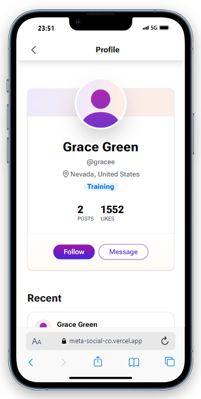

<h1 align="center">Meta Social</h1>

Welcome to Meta Social. Meta Social is a mock social media application built as a technical test for [Metaversal](https://www.metaversal.gg). It utilizes [Next.js](https://nextjs.org/docs), [Tailwind CSS](https://tailwindcss.com/), and [Typescript](https://www.typescriptlang.org/) to achieve a tiny but sleek peek into what a modern fullstack app looks like. 

screenshot of what the app should look like on mobile.

## Table of Contents

- [Features](#features) ⚙️
- [Technologies Used](#technologies-used) 🛠️
- [How To Run](#how-to-runlocally) 🧑‍💻
- [Contact](#contact) ✉️

## Features ⚙️

- General Feed
    - Suggested Posts
    - Users to Follow
    - Most Recent Posts
- User Profile Feed
    - User Recent Posts
- Easter Egg! 🥚

## Technologies Used 🛠️

- [Next.js](https://nextjs.org/docs): A React framework for building server-side rendered and statically generated applications.
- [Tailwind CSS](https://tailwindcss.com): A utility-first CSS framework for rapid UI development.
- [Shadcn Ui](https://ui.shadcn.com): A suite of fully accessible and customozable components.
- [TanStack Query](https://tanstack.com/query/latest): Lean react library for asyncronous state management. 
- [TypeScript](https://www.typescriptlang.org/): A typed superset of JavaScript that provides enhanced tooling and developer productivity.

## How To Run(Locally) 🧑‍💻

1. `git clone https://github.com/CodeHadIt/meta-social.git`
2. `npm i` / `yarn i` / `pnpm i` / `bun i`
3.  `npm run dev` / `yarn dev` / `pnpm dev` / `bun dev`

## Contact ✉️

If you have any questions, suggestions, or feedback regarding Meta Social, please feel free to reach out on [X](https://x.com/codehadit) or [Telegram](https://t.me/Codehadit).

## Learn More

To learn more about Next.js, take a look at the following resources:

- [Next.js Documentation](https://nextjs.org/docs) - learn about Next.js features and API.
- [Learn Next.js](https://nextjs.org/learn) - an interactive Next.js tutorial.

You can check out [the Next.js GitHub repository](https://github.com/vercel/next.js) - your feedback and contributions are welcome!
